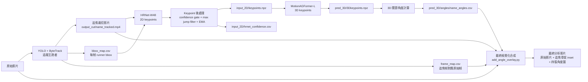

# 1.  目的與使用情境
說明:
這支程式是用來做多相機跑者追蹤與運動數據分析。它會自動從各機位影片中鎖定主要跑者，依照設定的起終點與切換條件，把多段影片串成一段連續追蹤結果，並同步計算距離、速度和加速度，輸出成影片與 CSV，方便後續做表現分析與結果展示。

## 目前模型偵測與分析流程圖



一句話流程：

原始影片先經過 YOLO + ByteTrack 鎖定主跑者，產生追焦裁切影片、bbox_map.csv 與 frame_map.csv；接著 HRNet-W48 使用 bbox_map.csv 限定人體範圍並估計 2D 骨架，再透過 confidence gate、max jump filter 和 EMA smoothing 穩定 keypoints；穩定後的 2D keypoints 送入 MotionAGFormer-L 轉成 3D 骨架，計算關節角度，最後把原始影片、追焦骨架畫面與角度圖同步合成為最終分析影片。


![image]
(https://hackmd.io/_uploads/By2fTpSC-e.png)


# 2. 多相機串接與切換邏輯 
說明:
多相機處理方式，是把不同鏡位影片依照跑者前進順序做串接。系統會先在前一台相機中持續追蹤主跑者，當跑者到達預設的切換點或越過終點線後，再自動切到下一台相機。這樣可以把多段影片整合成一段連續的跑步追蹤結果，同時保留跨鏡位的距離與速度連續性。
# 3. 畫面裁切與起跑線／終點線判定方式

```
CAM1 = camera("/home/jeter/pipeline_release/video/IMG_2526_11.mp4",                        # ← 填入影片路徑或改用 --config-json
              crop=(0, 400, 1920, 800), #(x起, y起, x終, y終) 裁剪範圍
======================================================
start_line  [(x1,y1), (x2,y2)]  起跑線兩端點（原始影像座標）
# end_line    [(x3,y3), (x4,y4)]  終點線兩端點（原始影像座標）
======================================================
              start_line=[(208, 715), (123, 725)], 
              end_line  =[(1760, 710), (1830, 718)],
              distance_m=20)

CAM2 = camera("/home/jeter/pipeline_release/video/IMG_2538_9.mp4",
              crop=(0, 400, 1920, 800),
              start_line=[(208, 715), (123, 725)],
              end_line  =[(1760, 710), (1830, 718)],
              distance_m=20)

CAM3 = camera("/home/jeter/pipeline_release/video/0420_10.mp4",
              crop=(0, 400, 1920, 800),
              start_line=[(215, 713), (130, 727)],
              end_line  =[(1735, 715), (1820, 722)],
              distance_m=20)
```
**起跑線／終點線判定方式:**
camera() 裡定義 start_line 與 end_line:
```
distance_m=None,
start_line=None, end_line=None,
pre_roll_px=200,
```
只要同時設定起跑線與終點線，就啟用斜線模式位置:
```
    start_mid = end_mid = track_dir = pixel_span = quad_roi = None
    if start_line is not None and end_line is not None:
        start_mid = ((start_line[0][0] + start_line[1][0]) / 2.0,
                     (start_line[0][1] + start_line[1][1]) / 2.0)
        end_mid   = ((end_line[0][0] + end_line[1][0]) / 2.0,
                     (end_line[0][1] + end_line[1][1]) / 2.0)
        dx = end_mid[0] - start_mid[0]
        dy = end_mid[1] - start_mid[1]
        pixel_span = (dx ** 2 + dy ** 2) ** 0.5
        if pixel_span > 0:
            track_dir = (dx / pixel_span, dy / pixel_span)
        switch_x = None
        quad_roi = np.array(
            [start_line[0], end_line[0], end_line[1], start_line[1]],
            dtype=np.float32
        )

```
做了幾件事：
算出起跑線中點 start_mid
算出終點線中點 end_mid
建立跑道方向 track_dir
算出起終點之間的像素距離 pixel_span

# 4. 起跑確認與 pre-roll 緩衝機制
說明:
起跑判定不是跑者一過線就立刻成立，而是先進入候選觀察區。程式會在起跑線前用 pre_roll_px 保留預先觀察範圍，等跑者超過起跑線後，再用 candidate_buf 暫存候選幀，並要求連續 3 幀都持續往前，才正式認定起跑。確認後再把這幾幀一起補回正式資料，避免誤判，也避免漏掉真正起跑的前幾幀。
```
else:  # proj_px >= 0：進入候選區
 # 若不是單調遞增（後退或持平）→ 清空候選，從頭收集
if candidate_buf and proj_px <= candidate_buf[-1][2]:
candidate_buf.clear()

candidate_buf.append((strip, dist_val, proj_px, bbox_strip))

 if len(candidate_buf) >= K_CONFIRM:                 # 確認起跑！
runner_crossed_start = True               
for c_strip, c_dist, _, c_meta in candidate_buf:
frame_buffer.append(c_strip)
 d_raw.append(c_dist)
meta_buffer.append(c_meta)                      
candidate_buf.clear()
```

# 5. 主跑者選取規則
說明:
系統會先把畫面中的人物做篩選，只保留合理的跑道目標，再根據每個人連續幀的移動情況判斷誰是真正在跑的人。正常情況下，主跑者會選擇移動最明顯、速度最高的對象；在起跑或切鏡初期，則會輔以位置規則，優先選擇最接近起跑線或跑在最前面的目標，以提高追蹤穩定度。

分成三層。第一層是先排除不合理目標，例如人物框太小的遠景人物，或不在 ROI 區域內的人。第二層是對每個追蹤 ID 累積移動紀錄，包含中心點位移、連續移動次數、靜止次數等。第三層是在目前有效追蹤對象中，選出最符合條件的人作為主跑者。在起跑前確認階段，或剛切相機、資料不足時，則會改用「最接近起跑線」或「在跑道方向上最前面的人」做補充判斷。
對應code:
```
1. 過濾候選人物：太小的框先排除
        for i in range(len(boxes)):
            bx1, by1, bx2, by2 = map(int, boxes[i])
            if (by2 - by1) < MIN_PERSON_HEIGHT:
                continue
            
```
    2.只有在跑道範圍內的人，才會被考慮成主跑者。
            orig_cx = center_x + crop_x_offset
            orig_cy = center_y + crop_y_offset
            proj = None
            if track_roi is not None:
                proj = _project_onto_track(
                    (orig_cx, orig_cy),
                    track_roi['start_mid'], track_roi['track_dir']
                )
                pre_roll = track_roi.get('pre_roll_px', 0)
                if not (-pre_roll <= proj <= track_roi['pixel_span']):
                    continue
            elif roi_enabled and roi_zones:
                if not any(z['x'][0] <= orig_cx <= z['x'][1] and
                           z['y'][0] <= orig_cy <= z['y'][1]
                           for z in roi_zones):
                    continue
```
3. 起跑前模式下，只保留最接近起跑線的一人
        if nearest_to_start and valid_detections:
            valid_detections.sort(key=lambda x: x[0])
            valid_detections = valid_detections[:1]

```
```
4.正常情況下，主跑者是「平均位移速度最大」的人
    fastest_id = None
    max_vel = 0
    for tid, d in velocity_tracker.items():
        if d['frames_since_detected'] == 0:
            if (d['movement_count'] >= MIN_MOVEMENT_FRAMES and
                    d['stationary_count'] < 10):
                v = np.mean(d['velocities']) if d['velocities'] else 0
                if v > max_vel:
                    max_vel = v
                    fastest_id = tid

```
。正常情況下，系統會選擇移動速度最明顯的目標；在起跑前或切鏡初期，則會暫時參考起跑線距離與跑道前後位置來找主跑者，確保主跑者選取更穩定。
# 6. 距離換算與校正方式
當有設定 start_line 和 end_line 時，程式會取這兩條線的中點，計算它們之間的像素距離，並以這段像素長度對應實際距離 distance_m，換算出 m_per_pixel。程式會先把跑者中心點投影到跑道方向上，取得從起跑線中點開始算的投影像素距離，再乘上 m_per_pixel，得到該幀實際距離
```
=====================================
先算起跑線與終點線中點距離算 start_mid
算 end_mid
算兩點之間的像素距離 pixel_span
算跑道方向 track_dir
=====================================
    start_mid = end_mid = track_dir = pixel_span = quad_roi = None
    if start_line is not None and end_line is not None:
        start_mid = ((start_line[0][0] + start_line[1][0]) / 2.0,
                     (start_line[0][1] + start_line[1][1]) / 2.0)
        end_mid   = ((end_line[0][0] + end_line[1][0]) / 2.0,
                     (end_line[0][1] + end_line[1][1]) / 2.0)
        dx = end_mid[0] - start_mid[0]
        dy = end_mid[1] - start_mid[1]
        pixel_span = (dx ** 2 + dy ** 2) ** 0.5
        if pixel_span > 0:
            track_dir = (dx / pixel_span, dy / pixel_span)

```
      # m_per_pixel 的換算公式
      # m_per_pixel = distance_m / pixel_span
    start_x = start_mid[0] if start_mid else roi_x[0]
    if start_line is not None and end_line is not None and pixel_span and distance_m is not None:
        m_per_pixel = distance_m / pixel_span
    elif distance_m is not None and roi_x[1] > roi_x[0]:
        m_per_pixel = distance_m / (roi_x[1] - roi_x[0])
    else:
        m_per_pixel = None

# 7. 多台相機距離的累積
說明 :
目前系統不是用跨鏡頭的人員重識別去比對同一個 ID，而是每台相機先獨立找出該段的主跑者，再依照跑者前進順序把各段距離接續起來。換句話說，它是用流程上的接棒方式，把每一段主跑者視為同一位跑者，完成全程距離計算。
```
1.每台相機的 YOLO tracking ID 都是局部的，不是全域共用
        velocity_tracker = {}
        if hasattr(model, 'predictor') and model.predictor is not None:
            if hasattr(model.predictor, 'trackers'):
                for t in model.predictor.trackers:
                    t.reset()
2.總距離靠 cumulative_dist_offset 串接
    cumulative_dist_offset = 0.0
    dist_raw = cumulative_dist_offset + max(0.0, proj_px * cam['m_per_pixel'])
3.每台相機結束後，把最後距離傳給下一台
cumulative_dist_offset = float(d_smooth[-1]) if len(d_smooth) > 0 else cumulative_dist_offset
```


# 8. 速度與加速度計算方法
**Kalman 濾波:**
當量測值有雜訊，但系統本身又有一個可描述的動態規律時，怎麼把「模型預測」和「實際量測」最佳地融合，得到對真實狀態的估計。
假設你在觀察一個正在移動的物體，例如跑者。

你真正想知道的是：
* 位置
* 速度
* 加速度
但你實際量到的，常常只有「帶雜訊的位置」。
例如真實位置可能是：
```
0.0, 0.5, 1.0, 1.5, 2.0
```
但YOLO量到的是：
```
0.1, 0.7, 0.8, 1.9, 1.7
```
會發現：
量測值有抖動
直接拿量測值做差分，速度會亂跳
直接相信模型也不行，因為真實運動可能和模型不完全一致
**Kalman 濾波就是把這兩邊結合：
一邊相信物理模型的連續性
一邊保留量測對結果的修正能力**

**Kalman 濾波每一步就是這四件事：**
用模型往前預測狀態
用模型往前預測不確定性
比較量測和預測差多少
用 Kalman Gain 決定修正多少
```
新估計 = 舊預測 + 權重 × (量測 - 預測)
這個權重不是固定的，而是根據 P、Q、R 動態算出來的。
```
**狀態空間模型:**
狀態方程:
```
x_k = F x_(k-1) + B u_k + w_k
```
量測方程:
```
z_k = H x_k + v_k
```


基本運動學：
```
p_k = p_(k-1) + v_(k-1) dt + 1/2 a_(k-1) dt^2
v_k = v_(k-1) + a_(k-1) dt
a_k = a_(k-1)
```
寫成矩陣就是:
```
[ p_k ]   [1  dt  1/2 dt^2] [ p_(k-1) ]
[ v_k ] = [0   1      dt   ] [ v_(k-1) ] + w_k
[ a_k ]   [0   0       1   ] [ a_(k-1) ]
```
如果量到的只有位置，那量測方程就是：
```
z_k = [1 0 0] x_k + v_k
```
所以：
`H = [1 0 0]`

**Kalman 濾波的兩大步驟**
每一個時間點都做兩件事：
預測 predict
更新 update
**1.預測步驟:根據上一時刻的估計，先預測這一刻狀態。**
狀態預測:
```
x̂_k^- = F x̂_(k-1)
```
x̂_k^-
: 第 k 時刻的先驗估計，意思是「還沒看量測之前，我根據模型猜的狀態」。

**誤差共變異數預測:**
```
P_k^- = F P_(k-1) F^T + Q
```
P: 狀態估計誤差的共變異數矩陣。代表你對估計值有多不確定。
Q: 過程雜訊共變異數。表示你認為模型本身有多不可靠。
直覺上：
每往前預測一步，不確定性通常會變大
因為你越來越依賴模型，而模型不是完美的
**2.更新步驟**
當新量測 z_k 來了，就拿它修正預測值。先算量測殘差，也叫 innovation：
```
y_k = z_k - H x̂_k^-
```
接著算殘差的共變異數：
`S_k = H P_k^- H^T + R
;R: 量測雜訊共變異數。
表示感測器有多不準。`
**然後算最重要的 Kalman Gain：**
`x̂_k = x̂_k^- + K_k y_k
;     K_k
: Kalman 增益。
它決定這一刻你應該相信量測多少、相信模型多少。`
更新誤差共變異數：
```
P_k = (I - K_k H) P_k^-
```

**. Kalman Gain 的數學意義**
**R 很小**
表示：
很信量測，覺得感測器很準。

**反過來，如果：**
量測很吵，R 很大,少信量測，覺得感測器很吵。

 K_k 會比較小，代表：
更相信模型預測
**所以 Kalman 濾波本質上就是一種自適應加權融合：**
量測可信時，偏向量測
模型可信時，偏向模型

**Q 大，表示：**
少信模型，多保留動態變化彈性。

**Q 小，表示：**
很信模型，覺得運動狀態應該很平滑。

Q 大：少信模型，反應快，但較抖
Q 小：多信模型，較平滑，但較鈍
R 大：少信量測，較平滑，但可能跟不上
R 小：多信量測，反應快，但可能吃噪聲

白話理解:
系統先說：「照上一幀的速度和加速度來看，這一幀你應該在 5 公尺附近。」
感測器說：「我現在量到好像是 4.8 公尺。」
系統就回答：「好，那我不要完全信自己，也不要完全信量測，我把位置稍微往 4.8 修，速度也順便往下調一點。」
# 9.code計算速度加速度流程:
**總體流程:**
在這支程式裡，速度與加速度的計算分成兩段。第一段先從每幀主跑者位置換算出原始距離序列 d_raw；第二段再對整段距離做單調約束、Butterworth 低通平滑，最後用 Kalman 濾波估計每一幀的速度 v_smooth 和加速度 a_arr。這樣做可以降低偵測抖動對速度與加速度的影響，讓輸出結果比直接用幀差更穩定，也能在多相機切換時延續前一段的運動狀態。
**1. 第一段先收集距離，不先算最終速度**
```
        #先把畫面位置換成距離
        #但這時候只是得到原始距離 dist_raw
        # 第一段：YOLO 追蹤，收集幀畫面與原始距離
        print(f"  [第一段] YOLO 追蹤中...")
        while True:
            ret, frame = cap.read()
            if not ret:
                break
            if cam['m_per_pixel'] is not None:
                d = velocity_tracker[fastest_id]
                bx1, by1, bx2, by2 = d['bbox']
                cx_orig = (bx1 + bx2) / 2.0 + crop_x_offset
                if cam.get('track_dir') and cam.get('start_mid'):
                    cy_orig  = (by1 + by2) / 2.0 + crop_y_offset
                    proj_px  = _project_onto_track((cx_orig, cy_orig),
                                                   cam['start_mid'], cam['track_dir'])
                    dist_raw = cumulative_dist_offset + max(0.0, proj_px * cam['m_per_pixel'])
                else:
                    dist_raw = cumulative_dist_offset + max(0.0, (cx_orig - cam['start_x']) * cam['m_per_pixel'])

```
**2. 第二段正式計算速度與加速度**
```
        has_metrics = cam['m_per_pixel'] is not None and CHART_HEIGHT > 0 and len(d_raw) > 0
        if has_metrics:
            print(f"  [第二段] 計算 Butterworth + Kalman（init_v={last_kf_v:.2f}, init_a={last_kf_a:.2f}）...")
            d_smooth, v_smooth, a_arr = _compute_kf_series(d_raw, fps,
                                                           init_v=last_kf_v,
                                                           init_a=last_kf_a)
```
**3. _compute_kf_series() 裡的實際流程**

```
    1.Butterworth 低通平滑距離,先用 Butterworth 低通濾波把距離曲線磨平
    if n >= 15:
        try:
            b_but, a_but = butter(2, 6.0 / (fps / 2.0), btype='low')
            d_smooth = filtfilt(b_but, a_but, d)
            for k in range(1, n):
                if d_smooth[k] < d_smooth[k - 1]:
                    d_smooth[k] = d_smooth[k - 1]
            d_smooth = np.maximum(d_smooth, d[0])
        except Exception:
            d_smooth = d.copy()
    else:
        d_smooth = d.copy()

```
**4.Kalman 從距離估速度與加速度**
```
            kf = KalmanFilter(dim_x=3, dim_z=1)
            kf.F = np.array([[1, dt, 0.5 * dt ** 2],
                             [0,  1,            dt],
                             [0,  0,             1]])
            kf.H = np.array([[1, 0, 0]])
 
```
初始化時，會把前一台相機最後的速度和加速度帶進來。位置：
```
            kf.x = np.array([[d_smooth[0]], [float(init_v)], [float(init_a)]])

```
**5. 跨相機怎麼延續速度與加速度
每台相機算完後，會把最後一幀速度與加速度存起來。
```
            last_kf_v = float(v_smooth[-1])
            last_kf_a = float(a_arr[-1])

```
下一台相機進來時，再當成 Kalman 初始值：
```
d_smooth, v_smooth, a_arr = _compute_kf_series(d_raw, fps,
                                               init_v=last_kf_v,
                                               init_a=last_kf_a)
```
------
# 2026/0505更新
## HRNet 骨架點 EMA 更新與低信心點處理

EMA 更新是 Exponential Moving Average，中文可以理解為「指數移動平均」。

更新後的位置 = alpha × 上一幀位置 + (1 - alpha) × 這一幀偵測位置

alpha = 0.40

也就是：
```
smooth = 0.40 * previous + 0.60 * current
```

### 為什麼要做 EMA 更新

目前 YOLO tracking 的 bbox 已經可以完整追到跑者，沒有明顯切到人，所以骨架點亂飄主要不是 bbox 問題，而是 HRNet 在做 2D keypoints 偵測時，每一幀都是獨立判斷。

跑步影片裡特別容易發生：
```
腳踝、膝蓋、手腕移動很快
影片有 motion blur
左右腳會交錯
某些幀關節被遮擋
```

這些狀況會讓 HRNet 某一幀抓錯點。如果直接把 HRNet 原始 2D keypoints 丟進 MotionAGFormer，錯誤會被放大：
```
HRNet 2D 點抖動
→ MotionAGFormer 3D 骨架抖動
→ 角度曲線跳動
→ 最終影片看起來骨架飄、角度不穩
```

EMA 的作用是讓骨架點有「時間連續性」。
利用上一幀的位置來限制這一幀：

```
如果 HRNet 這一幀可信：
    用 EMA 慢慢更新骨架點位置
如果 HRNet 這一幀不可信：
    沿用上一幀位置，不讓錯點進入 MotionAGFormer
```

### 我目前怎麼做

目前不是只做單純 EMA，而是多加兩個條件：

```
1. confidence 要夠高
2. 和上一幀的位置距離不能跳太遠
3. 兩個條件都通過後，才做 EMA 更新
```

目前參數：
```
alpha = 0.40
conf_threshold = 0.50
max_jump_px = 45.0
```

意思是：

* confidence >= 0.50：代表 HRNet 對這個關節點有一定把握
* max_jump_px <= 45.0：代表這個關節點相對上一幀沒有突然跳太遠
* 通過後才用 EMA 更新
* 如果 confidence 太低，或單幀跳超過 45.0 px，就沿用上一幀平滑後的位置
* alpha = 0.40 代表保留 40% 上一幀結果，採用 60% 目前 HRNet 偵測結果，是穩定度與快速跑步動作跟隨性的折衷設定

對應邏輯：
```
high_conf = current_score >= 0.50
jump = distance(current_point, previous_point)
plausible_motion = jump <= 45.0

if high_conf and plausible_motion:
    smooth = 0.40 * previous + 0.60 * current
else:
    smooth = previous
```

### 這樣會讓原本結果怎麼變好

原本 HRNet 是逐幀偵測，某一幀腳踝或膝蓋抓錯，就會直接影響後面的 3D 骨架與角度計算。加入 EMA 和低信心點處理後，可以改善：

* 減少單幀 keypoint 突然跳動
* 避免低 confidence 的錯點直接進入 MotionAGFormer
* 避免腳踝、膝蓋、手腕突然被拉到背景或錯誤位置
* 讓 2D keypoints 更連續
* 讓 3D 骨架和角度曲線比較穩定

簡單來說，這個更新不是改變 HRNet 模型本身，而是在 HRNet 輸出後加一層時間穩定處理：

```
HRNet raw keypoints
→ confidence + max jump 檢查
→ EMA 平滑
→ MotionAGFormer 3D 骨架
→ 角度計算
```

這樣可以減少 HRNet 單幀偵測錯誤造成的骨架飄動，讓後續 3D 角度分析更穩定。
